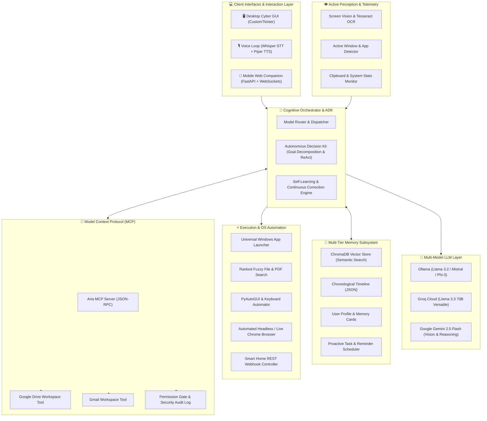

<div align="center">

# 🌌 ARIA — Autonomous Reactive Intelligence Assistant

**Next-Generation Multi-Device Autonomous AI Agent for Windows & Beyond**

[](https://python.org)
[](https://fastapi.tiangolo.com)
[](https://ollama.com)
[](https://aistudio.google.com)
[](https://groq.com)
[](https://modelcontextprotocol.io)
[](LICENSE)

<p align="center">
  <b>Aria</b> is an advanced, hybrid local-cloud autonomous AI agent built for deep Windows OS automation, multimodal vision understanding, multi-tier persistent memory, continuous learning, and multi-device companion control.
</p>

[Key Features](#-key-features) • [System Architecture](#-architectural-design) • [Quickstart & Installation](#-quickstart--installation) • [Usage Modes](#-usage-modes) • [Command Guide](#-command-cheatsheet) • [Security & Privacy](#-security--privacy-design)

</div>

---

## 🌟 Overview

**Aria** transforms your computer into an intelligent, voice-reactive autonomous workstation. Unlike traditional chatbots, Aria possesses **situational awareness**, **screen perception**, **file system autonomy**, and an **extended tool executor** that enables it to operate Windows apps, automate web workflows, manage smart home devices, and bridge your local workstation with mobile devices seamlessly.

### Why Aria?
- 🔒 **Local-First & Private:** Fully functional offline using **Ollama** (Llama 3.2, Mistral, Phi-3) and local **Piper Neural TTS**.
- ⚡ **Hybrid Cloud Power:** Seamless auto-routing to **Groq Cloud** (sub-second Llama 3.3 70B) or **Google Gemini 2.5 Flash** for vision and heavy reasoning.
- 👁️ **Visual Perception & OCR:** Takes screen captures, analyzes active windows, extracts text, and locates visual UI elements to interact with.
- 🧠 **Multi-Tier Persistent Memory:** ChromaDB semantic vector search + long-term user profile + chronological conversation timeline + self-correcting memory.
- 📱 **Multi-Device Companion:** Built-in FastAPI server with real-time WebSockets and an HTML5 mobile interface to control your PC from any smartphone or tablet on your LAN.
- 🔌 **Model Context Protocol (MCP):** Native MCP Client & Server implementation supporting Google Drive, Gmail, local knowledge vaults, and sandboxed file tools.

---

## 🏛️ Architectural Design

Aria is structured in a modular, decoupled architecture where perception, cognitive reasoning, memory storage, and tool execution operate independently yet synergize in real time.

### 📐 High-Level Architecture Diagram



---

### 🧩 Detailed Subsystem Breakdown

```
c:\MyAgent\
├── core/                  # Cognitive Orchestration & Engine
│   ├── agent_core.py      # Main Agent Brain, Conversation Loop & LLM Routing
│   ├── aria_adk.py        # Autonomous Decision Kit (Goal decomposition, ReAct tool loop)
│   ├── aria_memory.py     # ChromaDB Vector Store & Semantic Memory Retrieval
│   ├── aria_learning.py   # Continuous Self-Correction & Alias Learning Engine
│   ├── aria_scheduler.py  # Background Reminder & Proactive Alarm Scheduler
│   ├── aria_system_context.py # Screen OCR, Running Apps, Active Window & Telemetry
│   └── paths.py           # Centralized Dynamic Path & Workspace Resolution
│
├── tools/                 # OS, Browser & Extended Automation
│   ├── aria_tools.py      # Core Tool Registry, System Controls & Media Handlers
│   ├── aria_extended.py   # Smart Home IoT, Window Manipulation, File Indexer
│   ├── aria_chrome.py     # Chrome Browser Automation, DuckDuckGo & Web Search
│   ├── aria_organizer.py  # Automated Desktop/Downloads File Categorization
│   └── aria_vision_executor.py # Visual Element Detection & Screen Coordinate Clicker
│
├── server/                # Multi-Device & Mobile Companion
│   ├── aria_api.py        # FastAPI Backend, WebSocket Stream & HTML5 Mobile App
│   ├── aria_auth.py       # Session Token Management, RBAC & Master Admin Login
│   └── setup_google_auth.py # OAuth2 Workflow for Gmail & Google Drive API
│
├── mcp/                   # Model Context Protocol (MCP) Implementation
│   ├── aria_mcp_server.py # Security-First JSON-RPC MCP Server
│   ├── aria_mcp_client.py # Client Connector for Local & Remote MCP Services
│   └── aria_mcp_config.json # Path Whitelist, File Size Caps & Permissions
│
├── gui/                   # Desktop Graphical User Interface
│   └── aria_gui.py        # Cyber-Purple Desktop Dashboard (CustomTkinter + Waveform)
│
├── data/                  # Persistent Knowledge & Long-Term Storage
│   ├── aria_memory/       # ChromaDB SQLite Vector DB & Embeddings
│   ├── memory_timeline.json # Chronological Conversation History
│   ├── memory_cards.json  # Distilled User Memory Highlights
│   ├── profile.json       # User Preferences, Identity & Facts
│   └── knowledge/         # Local Document Knowledge Base
│
├── config/                # Configuration & Template Store
│   ├── .env.example       # API Key Template
│   ├── gui_config.example.json # GUI Theme & Hardware Default Config
│   └── aria_auth.example.json  # Multi-Device RBAC Template
│
├── tests/                 # Comprehensive Unit & Regression Test Suite
│   ├── test_aria.py       # Core Tool, Auth, and System Tests
│   └── test_adk.py        # ADK ReAct Execution & Tool Invocation Tests
│
├── agent.py               # Root CLI & Voice Launcher
├── aria_gui.py            # Root Desktop GUI Launcher
└── aria_api.py            # Root Mobile Companion Server Launcher
```

---

## ✨ Key Features

### 1. 🧠 Multi-Model Cognitive Routing
Aria dynamically chooses the best model for the job:
- **Local Ollama (`llama3.2`, `mistral`, `phi3`):** Complete privacy, 0ms internet requirement, perfect for conversational tasks and offline control.
- **Groq Cloud (`llama-3.3-70b-versatile`):** Blazing-fast inference (~500 tokens/sec) for complex reasoning, tool calling, and code generation.
- **Google Gemini 2.5 Flash:** State-of-the-art vision understanding and massive context processing for analyzing documents and screen layouts.

### 2. 👁️ Screen Vision & Active System Context
- Real-time OCR and screen reading using `pytesseract` and Windows screen capture.
- Active window tracking: Aria knows which application you are working in (e.g., VS Code, Chrome, Spotify) and tailors its responses to your current task.
- Running processes and system resource telemetry (CPU, RAM, Battery status).

### 3. 🎯 Autonomous Decision Kit (ADK)
Aria implements a resilient **ReAct (Reason + Act)** autonomous execution loop:
1. **Perceive:** Captures user prompt + system context + retrieved memories.
2. **Decompose:** Splits complex multi-step instructions into discrete actions.
3. **Execute:** Calls tool APIs with type-safe parameters.
4. **Reflect:** Inspects tool output; if an error occurs, it autonomously self-corrects and tries alternate strategies.

### 4. 🗄️ Multi-Tier Persistent Memory
- **Semantic Memory (ChromaDB):** Embeds past interactions and knowledge docs into high-dimensional vector space for semantic similarity recall.
- **Episodic Memory (Timeline):** Chronological log of recent sessions.
- **Fact Storage (Profile):** User preferences, names, favorite apps, and habit profiles.
- **Adaptive Learning:** The self-learning engine registers mistakes and user corrections into `learned_corrections.json` so Aria never makes the same mistake twice.

### 5. 📱 Multi-Device Companion Server
Launch `aria_api.py` to turn your PC into a personal cloud assistant:
- Access Aria from your smartphone, tablet, or secondary laptop on the same local Wi-Fi.
- Control volume, open applications, search files, or dictate notes hands-free from another room.
- Protected by token-based authentication and role-based permissions (Master Admin vs Guest).

### 6. 🔌 Model Context Protocol (MCP) Integration
- Implements the open standard **Model Context Protocol (MCP)**.
- Securely interacts with **Google Drive** (search, read, write documents) and **Gmail** (search, draft, send emails).
- Security audit log (`aria_mcp_audit.log`) ensures zero unpermitted actions.

---

## ⚡ Quickstart & Installation

### Prerequisites
- **Operating System:** Windows 10 or Windows 11 (64-bit)
- **Python:** Python 3.10, 3.11, or 3.12
- **Ollama:** [Download Ollama for Windows](https://ollama.com) (Recommended for local offline AI)
- **Tesseract OCR (Optional for Screen Vision):** [Download Tesseract Windows Installer](https://github.com/UB-Mannheim/tesseract/wiki)

---

### Step 1 — Clone the Repository
```bash
git clone https://github.com/Aviral445/ARIA.git
cd ARIA
```

### Step 2 — Create and Activate a Virtual Environment
```bash
# Using PowerShell
python -m venv venv
.\venv\Scripts\Activate.ps1
```

### Step 3 — Install Dependencies
```bash
pip install -r requirements.txt
```

> **PyAudio Note for Windows:** If `pip install pyaudio` produces a compilation error, download the pre-compiled wheel for your Python version from [Gohlke Wheels](https://www.lfd.uci.edu/~gohlke/pythonlibs/#pyaudio) and install via `pip install PyAudio‑<version>.whl`.

### Step 4 — Pull Local Models with Ollama
```bash
# Start Ollama service, then pull the default model:
ollama pull llama3.2
```

### Step 5 — Configure Environment Variables
Copy the template `.env.example` to `.env`:
```bash
cp .env.example .env
```
Open `.env` in any text editor and fill in your API keys (optional if running purely on local Ollama):
```env
# Google Gemini API Key (https://aistudio.google.com/app/apikey)
GEMINI_API_KEY=your_gemini_api_key_here

# Groq Cloud API Key (https://console.groq.com/keys)
GROQ_API_KEY=your_groq_api_key_here

# Master Admin Password for Mobile Companion Server (Optional)
ARIA_ADMIN_PASSWORD=your_secure_password
```

---

## 🚀 Usage Modes

Aria supports three distinct execution modes depending on your workflow:

### Mode 1: 🖥️ Desktop Cyber GUI Dashboard
Features a sleek cyber-purple dark mode interface, animated voice visualizer, live event logs, memory inspector, and quick controls.
```bash
python aria_gui.py
```

### Mode 2: 🎙️ Voice & Terminal CLI Agent
Runs the lightweight hands-free voice loop with speech recognition and instant neural voice replies.
```bash
python agent.py
```

### Mode 3: 📱 Multi-Device Companion Server
Starts the FastAPI server with live WebSockets and prints the local network URL to connect from your mobile phone.
```bash
python aria_api.py
```
> Open `http://<YOUR_PC_LOCAL_IP>:8000` on your mobile browser (e.g., `http://192.168.1.50:8000`).

---

## 🗣️ Command Cheatsheet

Aria understands natural, conversational phrasing. Here are common examples:

| Category | Example Voice / Text Command | Action Performed |
| :--- | :--- | :--- |
| **App Launcher** | *"Open VS Code"* / *"Launch Spotify"* | Scans Start Menu & AppData shortcuts and opens the app (`0ms` index). |
| **Web & Search** | *"Search YouTube for lofi beats"* | Opens browser and directly queries YouTube or Google. |
| **File Search** | *"Find a PDF named machine learning on my laptop"* | Recursively scans Desktop, Documents, Downloads, & OneDrive with fuzzy match. |
| **Vision & Screen** | *"What's on my screen right now?"* | Captures screen, performs OCR, and analyzes active windows. |
| **Desktop Control** | *"Lock my computer"* / *"Set volume to 50%"* | Locks Windows session or adjusts master audio mixer. |
| **Smart Typing** | *"Type 'Meeting starts in 5 minutes' into active window"* | Simulates fast background typing via OS keystroke automation. |
| **File Organizer** | *"Organize my downloads folder"* | Categorizes files into Images, Documents, Videos, Installers automatically. |
| **Smart Home** | *"Turn on bedroom light"* | Sends authenticated REST webhook to local smart home switch. |
| **Memory** | *"Remember that my dog's name is Milo"* | Saves fact into ChromaDB vector memory and user profile. |
| **Reminders** | *"Remind me to drink water in 30 minutes"* | Schedules background timer and plays voice notification when due. |
| **Self-Learning** | *"Whenever I say 'focus mode', open VS Code and Spotify"* | Registers custom alias into self-learning continuous engine. |

---

## 🧪 Testing & Verification

Aria includes a built-in automated test suite covering tool registries, authentication, memory subsystems, and the ADK planner:

```bash
# Run all unit and integration tests:
python -m unittest discover -s tests
```

---

## 🛡️ Security & Privacy Design

- **Air-Gapped & Offline Ready:** When using Ollama and Piper TTS, zero audio or prompt data ever leaves your local machine.
- **Zero-Leak Git Architecture:** All sensitive files ([`.env`](file:///c:/MyAgent/.env), Google OAuth tokens, personal memory timelines, and databases) are protected by a strict [`.gitignore`](file:///c:/MyAgent/.gitignore) policy.
- **Permission Gated MCP:** Actions involving sensitive file writes or external services require explicit user authorization and produce entries in `aria_mcp_audit.log`.
- **Role-Based Device Access:** The multi-device companion enforces Master Admin credentials and device tokens.

---

## 🤝 Contributing

Contributions are warmly welcome! If you'd like to extend Aria's capabilities:
1. Fork the Project.
2. Create your Feature Branch (`git checkout -b feature/AmazingFeature`).
3. Commit your Changes (`git commit -m 'Add AmazingFeature'`).
4. Push to the Branch (`git push origin feature/AmazingFeature`).
5. Open a Pull Request.

---

## 📜 License

Distributed under the **MIT License**. See `LICENSE` for more information.

---

<div align="center">
  <b>Built with ❤️ for the future of Autonomous Personal Computing.</b>
</div>
