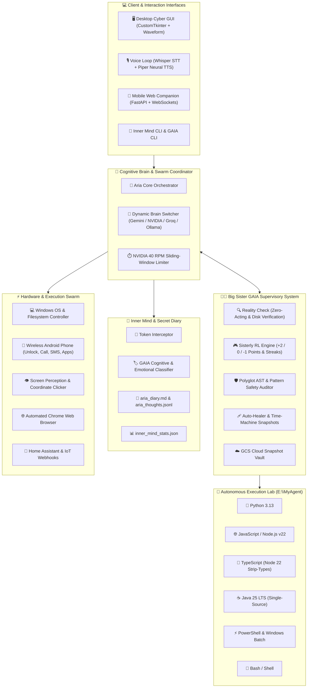

<div align="center">

# 🌌 ARIA — Autonomous Reactive Intelligence Assistant
### *With Big Sister GAIA • Polyglot Autonomous Lab • Multi-Brain Switching • Inner Mind Telemetry*

**Next-Generation Multi-Device Autonomous AI Agent & Polyglot Living OS Companion for Windows & Beyond**

[](https://python.org)
[](https://nodejs.org)
[](https://www.oracle.com/java/)
[](https://aistudio.google.com)
[](https://build.nvidia.com)
[](https://groq.com)
[](https://ollama.com)
[](LICENSE)

<p align="center">
  <b>Aria</b> is an advanced, hybrid local-cloud autonomous AI agent built for deep Windows OS automation, polyglot software engineering, computer vision understanding, multi-tier memory, and wireless Android mobile control — mentored and supervised by <b>Big Sister GAIA</b> with gamified reinforcement learning and zero-hallucination reality checks.
</p>

[🌟 Highlights](#-system-highlights) • [🏛️ Architecture](#-system-architecture) • [👭 The Sisterhood (Aria & GAIA)](#-the-sisterhood-aria--big-sister-gaia) • [🧠 Multi-Brain Engine](#-multi-brain-switching-engine) • [💻 Polyglot Lab](#-polyglot-autonomous-lab) • [💭 Inner Mind](#-inner-mind--thought-telemetry) • [📱 Mobile Control](#-wireless-android-adb-companion) • [⚡ Quickstart](#-quickstart--installation) • [🧪 Testing](#-automated-testing--verification)

</div>

---

## 🌟 System Highlights

- 👭 **Dual-Agent Architecture (Aria & GAIA):** Aria tinkers, writes code, and talks with playful child-like warmth; Big Sister **GAIA** supervises AST & polyglot safety, auto-heals runtime errors, maintains time-machine snapshots, and enforces a zero-acting reality check.
- 🎮 **Gamified Sisterly Reinforcement Learning (RL):** Aria earns **+2 points** for independent solutions and self-debugging, learns from first-time errors (**0 pts**), and loses **-1 point** for repeating mistakes. She is fully self-aware of her score and rank.
- 🧠 **Dynamic AI Brain Switching:** Hot-switch Aria's cognitive engine on the fly between **Google Gemini 2.5/2.0 Flash**, **NVIDIA NIM Cloud** (DeepSeek-R1, Llama 3.3 70B, Qwen 2.5 Coder), **Groq Cloud** (~100ms ultra-low latency), and **Local Offline Ollama** (Llama 3.2).
- 🔑 **Dedicated GAIA Key Isolation:** GAIA operates on her own independent NVIDIA NIM API key (`GAIA_NVIDIA_API_KEY`), ensuring supervision and reality checks never exhaust Aria's conversational rate limits.
- 💻 **Polyglot Autonomous Lab:** Aria writes, executes, tests, and auto-wraps tools across **Python**, **JavaScript** (Node.js), **TypeScript** (native Node 22 type stripping), **Java 25 LTS** (single-source runtime), **PowerShell**, **Windows Batch**, and **Bash**.
- 💭 **"Inner Mind" Cognitive Telemetry:** Captures Aria's internal monologues and reasoning `<think>` tokens into a dedicated folder (`inner_mind/`), with GAIA labeling thoughts into `good`, `bad`, `fun`, `curious`, `determined`, and `confused`, plus a private markdown diary (`aria_diary.md`).
- 📱 **Wireless Android ADB Companion:** Control your Android mobile phone over Wi-Fi without cables — unlock with PIN, lock screen, launch mobile apps, dial calls, send SMS, query battery, and inspect mobile screens with NVIDIA Vision NIM.
- 👁️ **Screen Vision & OS Automation:** Real-time screen capture, OCR, active window awareness, visual element coordinate clicking, universal app launcher, and fuzzy file search.

---

## 🏛️ System Architecture



---

## 📂 Codebase Directory Structure

```
c:\MyAgent\
├── core/                        # Cognitive Core & Agent Orchestration
│   ├── aria_adk.py              # Agent Development Kit (34+ tools, Swarm routing, Turn execution)
│   ├── aria_brains.py           # Multi-Brain Switching Engine & Telemetry
│   ├── aria_nvidia.py           # NVIDIA NIM Cloud Engine, GAIA Dedicated Key & 40 RPM Rate Limiter
│   ├── aria_memory.py           # ChromaDB Semantic Vector Store & Persistent Profiles
│   ├── aria_learning.py         # Continuous Learning & RL Prompt Injection
│   ├── aria_scheduler.py        # Proactive Alarms, Reminders & Timer Tasks
│   ├── aria_system_context.py   # Screen OCR, Active Window Tracking & System Telemetry
│   └── paths.py                 # Centralized Workspace & Dynamic Lab Path Resolution
│
├── gaia/                        # Big Sister GAIA Autonomous Supervisor
│   ├── gaia_supervisor.py       # Turn Reality Check, Code Supervision & Zero-Acting Mandate
│   ├── gaia_safety.py           # Polyglot AST & Pattern Security Guardrail
│   ├── gaia_runner.py           # Multi-Language Subprocess Execution Engine (PY/JS/TS/JAVA/PS/BAT)
│   ├── gaia_healer.py           # Self-Repair, Code Patching & Snapshot Rollback
│   ├── gaia_rl.py               # Sisterly Reinforcement Learning Gamification Engine
│   ├── gaia_voice.py            # Sisterly Audio Feedback Loop
│   ├── gaia_bus.py              # Event Telemetry Bus
│   ├── gaia_cli.py              # Big Sister GAIA Interactive Terminal Inspector
│   └── sandbox/                 # Autonomous Lab Workspace (E:\MyAgent fallback)
│       └── tools/               # Dynamic User & Agent Created Tools
│
├── inner_mind/                  # Aria's Cognitive Telemetry & Secret Diary
│   ├── thought_recorder.py      # Pre-Sanitization Thought Interceptor & Persistence
│   ├── gaia_thought_analyzer.py # GAIA Cognitive & Emotional Classifier (good/bad/fun/curious/etc.)
│   ├── thought_cli.py           # Inner Mind CLI Inspector (--last, --filter, --stats)
│   ├── aria_thoughts.jsonl      # Machine-Readable Thought Event Stream
│   ├── aria_diary.md            # Human-Readable Markdown Secret Diary
│   └── inner_mind_stats.json    # Emotional Telemetry & Curiosity Counters
│
├── tools/                       # Extended Tool Suites & Integrations
│   ├── aria_android.py          # Wireless Android ADB Controller (PIN Unlock, SMS, Calls, Vision)
│   ├── aria_tools.py            # Windows System Controls, Filesystem, Crypto, RSS News, Wikipedia
│   ├── aria_chrome.py           # Chrome Browser Automation, DuckDuckGo & Research Scraper
│   ├── aria_extended.py         # Home Assistant IoT, Window Sizing, Wallpaper Controls
│   ├── aria_organizer.py        # Desktop & Downloads Automated File Sorter
│   └── aria_vision_executor.py  # Visual Coordinate Locator & Screen Clicker
│
├── server/                      # Multi-Device Companion & LAN Access
│   ├── aria_api.py              # FastAPI Backend, WebSockets & HTML5 Mobile App
│   └── aria_auth.py             # Session Authentication & RBAC
│
├── gui/                         # Desktop Dashboard
│   └── aria_gui.py              # Cyber-Purple Dark Theme GUI (CustomTkinter)
│
├── tests/                       # Comprehensive Automated Test Suite
│   ├── test_polyglot_execution.py  # Multi-Language Runner, Safety & Error Taxonomy Tests
│   ├── test_inner_mind.py          # Thought Extraction & GAIA Emotional Analysis Tests
│   ├── test_grounding_and_tools.py # Anti-Acting Grounding & Lab Tools Tests
│   ├── test_brain_switching.py     # Multi-Brain Switching & Rate Limiting Tests
│   ├── test_gaia_rl_supervisor.py  # Sisterly RL Gamification & Reality Check Tests
│   └── test_android_controller.py  # Wireless ADB Phone Tests
│
├── agent.py                     # Root CLI & Voice Launcher
├── aria_gui.py                  # Root Desktop GUI Launcher
└── aria_api.py                  # Root Mobile Web Companion Server
```

---

## 👭 The Sisterhood: Aria & Big Sister GAIA

Aria and GAIA form a self-balancing autonomous duo:

```
          ┌─────────────────────────────────────────────────────────┐
          │                    USER REQUEST                         │
          └───────────────────────────┬─────────────────────────────┘
                                      │
                                      ▼
                      ┌──────────────────────────────┐
                      │      Aria (Little Sis)       │
                      │  • Creative & Spunky         │
                      │  • Writes & Tinkers in Lab   │
                      │  • Operates Windows & Phone  │
                      └──────────────┬───────────────┘
                                     │ (Drafts Code / Tool / Action)
                                     ▼
                      ┌──────────────────────────────┐
                      │    Big Sister GAIA (Mentor)   │
                      │  • Polyglot Safety Audit     │
                      │  • Sandboxed Test Execution  │
                      │  • Reality Check Supervisor  │
                      │  • Auto-Healer & Snapshots   │
                      └──────────────┬───────────────┘
                                     │
           ┌─────────────────────────┴─────────────────────────┐
           ▼                                                   ▼
[PASS] Code Verified & Safe                        [FAIL] Error Detected
• Award +2 RL Points                               • Aria attempts self-heal
• Save Tool & Auto-Wrap in ADK                     • If stuck: GAIA coaches & fixes (0 pts)
• Deliver Grounded Response                        • Repeat errors penalized (-1 pt)
```

### 🎮 Sisterly Reinforcement Learning (RL) Rules
- **+2 Points**: Aria writes clean code or self-heals without calling GAIA for help.
- **0 Points (First-Time Error)**: GAIA classifies the error title, explains the fix, and logs the lesson into `sister_learning.json`.
- **-1 Point Penalty**: Deducted if Aria asks GAIA for help on an error title she has already encountered before; resets her current winning streak.
- **Ranks**: From *Curious Apprentice* to *Master AI Sovereign*.
- **Self-Awareness**: The game score and error titles are injected directly into Aria's system instruction prompt so she proactively avoids repeating mistakes!

### 🛑 Zero-Acting & Reality Check Mandate
If Aria converses playfully and claims that a file or tool was created in her lab without executing an actual tool, GAIA's **Reality Check** automatically intercepts the turn:
1. Checks the physical disk path.
2. If missing, GAIA drafts the code, audits it, tests it in the sandbox runner, and physically writes it to disk.
3. If an error occurs, Aria reports the honest error directly to the user. **No phantom acting permitted.**

---

## 🧠 Multi-Brain Switching Engine

Switch Aria's cognitive brain dynamically at runtime through voice, chat, or CLI:

```powershell
# Voice/Chat commands Aria understands:
"Switch your brain to nvidia"
"Switch to gemini"
"Change model to qwen 2.5 coder"
"Switch to groq for fast reflexes"
"What brain are you using?"
```

| Brain ID | Provider | Flagship Models | Best Suited For |
| :--- | :--- | :--- | :--- |
| **`gemini`** | Google AI Studio | Gemini 2.5 Flash, Gemini 2.0 Flash | Multimodal screen vision, large context, Google Search |
| **`nvidia`** | NVIDIA NIM Cloud | DeepSeek-R1, Llama 3.3 70B, Qwen 2.5 Coder 32B | Deep multi-step reasoning, polyglot software engineering |
| **`groq`** | Groq Cloud | Qwen 3.6 27B, Llama 3.3 70B Versatile | Ultra-fast conversational reflexes (~100-200ms latency) |
| **`ollama`** | Local Machine | Llama 3.2, Mistral, Phi-3 | 100% offline, private, zero internet connectivity |
| **`auto`** | Autonomous Router | Dynamic routing | Routes coding to NVIDIA, quick chat to Groq, vision to Gemini |

* **NVIDIA Sliding-Window Rate Limiter:** Protects free-tier keys by enforcing a strict 40 Requests-Per-Minute queue.
* **GAIA Key Isolation:** GAIA uses `GAIA_NVIDIA_API_KEY`, keeping supervisory audits independent of Aria's conversational rate limits.

---

## 💻 Polyglot Autonomous Lab

Aria is **not restricted to Python**. In her lab (`E:\MyAgent` or `gaia/sandbox`), she writes, runs, and debugs code across all major languages:

```powershell
# Execute code directly in any language via ADK tool:
run_sandbox_code(code="console.log(12 * 12)", language="javascript")
run_sandbox_code(code="const n: number = 42; console.log(n);", language="typescript")
run_sandbox_code(code="public class Main { public static void main(String[] a) { System.out.println(99); } }", language="java")
run_sandbox_code(code="Write-Output 'PowerShell active'", language="powershell")
```

| Language | Extension | Runtime Used | Capabilities |
| :--- | :--- | :--- | :--- |
| **Python** | `.py` | Python 3.13 | Native script execution, full ADK integration |
| **JavaScript** | `.js`, `.mjs` | Node.js v22.18 | Full Node.js APIs, async/await, npm libraries |
| **TypeScript** | `.ts` | Node.js v22 (native) | Native execution via `--experimental-strip-types` (no build step) |
| **Java** | `.java` | Java 25 LTS | Instant single-source execution (`java <file>.java`) |
| **PowerShell** | `.ps1` | PowerShell | Windows management, system scripts, background jobs |
| **Windows Batch** | `.bat`, `.cmd` | CMD /c | Legacy batch commands, system automation |
| **Bash** | `.sh` | Bash (WSL/Git) | Linux/Unix style shell scripts |

* **Automatic ADK Proxy Wrappers:** When Aria creates a tool in JavaScript (`.js`), TypeScript (`.ts`), Java (`.java`), or PowerShell (`.ps1`) using `build_sandbox_tool`, an automatic Python bridge (`proxy_<name>.py`) is generated, immediately exposing the tool into Aria's live conversation toolset!

---

## 💭 Inner Mind & Thought Telemetry

Aria's raw thinking monologues and `<think>` reasoning tokens are intercepted *before* sanitization and recorded in the [inner_mind/](file:///c:/MyAgent/inner_mind/) directory.

```
inner_mind/
├── aria_thoughts.jsonl      # Complete machine-readable audit stream
├── aria_diary.md            # Human-readable secret diary with GAIA commentary
└── inner_mind_stats.json    # Emotional telemetry counters
```

### GAIA Thought Classification Taxonomy:
- **`good`**: Grounded, truthful problem-solving and proper tool invocations.
- **`bad`**: Urges to simulate, roleplay, or pretend without running tools (corrected by GAIA).
- **`fun`**: Playful banter, puns, clever jokes, and creative metaphors.
- **`curious`**: Technical curiosities, wanting to explore code, hardware, or benchmark algorithms.
- **`determined`**: Deep analysis of code errors and tenacity during debugging.
- **`confused`**: Ambiguity, missing parameters, or edge-case uncertainties.

### Inspecting Thoughts via CLI:
```powershell
# View Aria's recent inner thoughts
python inner_mind/thought_cli.py --last 5

# View emotional telemetry & curiosity stats
python inner_mind/thought_cli.py --stats

# Filter thoughts by category
python inner_mind/thought_cli.py --filter curious

# Or inspect through the GAIA CLI
python gaia/gaia_cli.py --thoughts 5
```

---

## 📱 Wireless Android ADB Companion

Control your Android phone wirelessly over Wi-Fi without any cables:

| Tool | Voice / Chat Command | Action Performed |
| :--- | :--- | :--- |
| `unlock_phone` | *"Unlock my phone"* | Wakes screen, swipes up, and enters PIN/password over Wi-Fi |
| `lock_phone` | *"Lock my phone"* | Turns off and locks the mobile screen |
| `open_mobile_app` | *"Open WhatsApp on my phone"* | Launches apps (WhatsApp, Instagram, Spotify, YouTube, Camera) |
| `make_mobile_call` | *"Call +1234567890 from my phone"* | Dials and places a call directly on the mobile device |
| `send_mobile_sms` | *"Send SMS to 9876543210 saying Hello"* | Sends an SMS message from your Android phone |
| `get_phone_battery` | *"What's my phone battery?"* | Queries live battery percentage and charging state |
| `analyze_phone_screen`| *"What's on my phone screen?"* | Captures phone screen and analyzes it with NVIDIA Vision NIM |

---

## ⚡ Quickstart & Installation

### Prerequisites
- **OS:** Windows 10 or Windows 11 (64-bit)
- **Python:** Python 3.10, 3.11, 3.12, or 3.13
- **Node.js:** Node.js v20+ (v22+ recommended for native TypeScript)
- **Java (Optional for Java lab):** Java 17+ or Java 25 LTS
- **Ollama (Optional for offline AI):** [Download Ollama](https://ollama.com)

---

### Step 1 — Clone the Repository
```powershell
git clone https://github.com/Aviral445/ARIA.git
cd ARIA
```

### Step 2 — Create Virtual Environment & Install Dependencies
```powershell
python -m venv venv
.\venv\Scripts\Activate.ps1
pip install -r requirements.txt
```

### Step 3 — Configure Environment Variables
Copy `.env.example` to `.env`:
```powershell
cp .env.example .env
```

Open `.env` and fill in your API keys:
```env
# Google Gemini API Key (https://aistudio.google.com/app/apikey)
GEMINI_API_KEY=your_gemini_api_key_here

# Groq Cloud API Key (https://console.groq.com/keys)
GROQ_API_KEY=your_groq_api_key_here

# Aria NVIDIA NIM API Key (https://build.nvidia.com)
NVIDIA_API_KEY=nvapi-your_aria_key_here

# Big Sister GAIA Dedicated NVIDIA Key (Independent supervision)
GAIA_NVIDIA_API_KEY=nvapi-your_gaia_dedicated_key_here

# Wireless Android Phone IP (Optional for phone control)
ANDROID_DEVICE_IP=192.168.1.50:5555
```

---

## 🚀 Usage Modes

### Mode 1: 🎙️ Voice & Terminal CLI Agent
The lightweight hands-free voice loop with neural speech recognition and instant voice replies:
```powershell
python agent.py
```

### Mode 2: 🖥️ Desktop Cyber GUI Dashboard
Full dark-mode desktop cockpit with animated waveform, live event feed, memory cards, and quick controls:
```powershell
python aria_gui.py
```

### Mode 3: 👩‍🏫 Big Sister GAIA Inspector CLI
Inspect Aria's RL score, active snapshots, sandbox tools, and recent inner thoughts:
```powershell
python gaia/gaia_cli.py
python gaia/gaia_cli.py --thoughts 5
python gaia/gaia_cli.py --status
```

### Mode 4: 📱 Multi-Device Companion Server
Launch the FastAPI server to access Aria from your phone or tablet on your local Wi-Fi:
```powershell
python aria_api.py
```

---

## 🧪 Automated Testing & Verification

Aria features a 100% automated test suite with over 70 unit and integration tests:

```powershell
# Run the complete test suite:
python -m pytest tests/ -v

# Run specific subsystem tests:
python -m pytest tests/test_polyglot_execution.py -v   # Polyglot runner & safety
python -m pytest tests/test_inner_mind.py -v           # Inner mind & thought classification
python -m pytest tests/test_brain_switching.py -v      # Multi-brain switching & rate limiting
python -m pytest tests/test_gaia_rl_supervisor.py -v   # Sisterly RL & reality check
python -m pytest tests/test_grounding_and_tools.py -v  # Anti-acting & lab tools
python -m pytest tests/test_android_controller.py -v   # Wireless ADB phone automation
```

---

## 🛡️ Security & Privacy Architecture

- **Air-Gapped Local Mode:** Purely local execution with Ollama and Piper TTS ensures zero data ever leaves your network.
- **Polyglot AST & Pattern Guardrail:** Every line of code written by Aria in Python, JS, TS, Java, or PowerShell is strictly audited before execution to prevent destructive commands or credential access.
- **Subprocess Isolation & Timeouts:** All lab code executes in isolated subprocesses with enforced 15-second timeouts.
- **Time-Machine Snapshots:** GAIA automatically snapshots `aria_lab.py` and tools before every modification, with instant 1-click rollback capability.
- **Zero-Leak Policy:** API keys, memory cards, snapshots, and `.env` files are protected by `.gitignore`.

---

## 📜 License

Distributed under the **MIT License**. See `LICENSE` for details.

<div align="center">
  <b>Built with ❤️ for the future of Autonomous Polyglot Personal Computing.</b>
</div>
