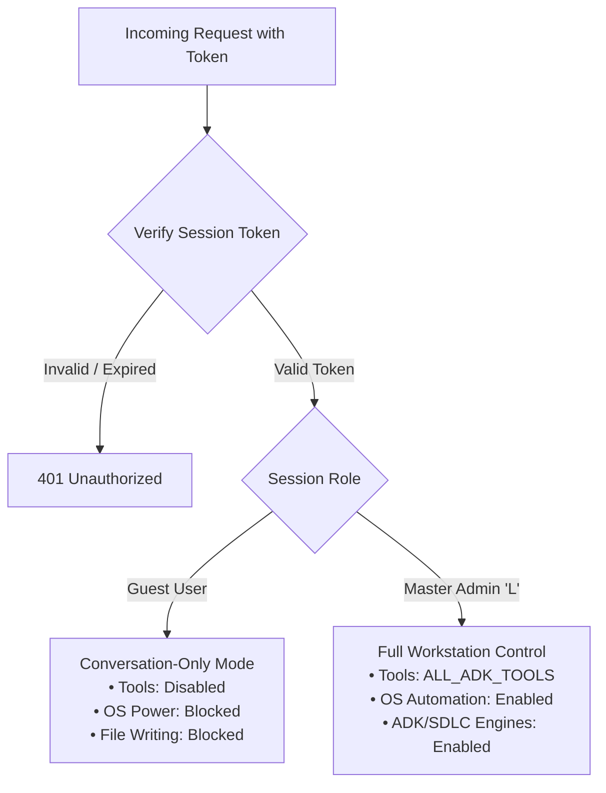
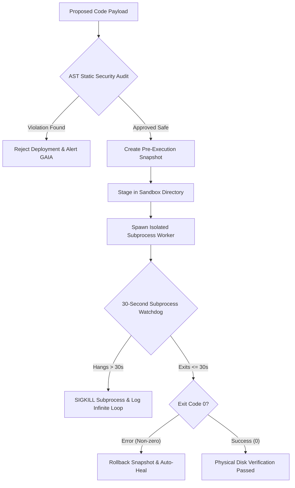
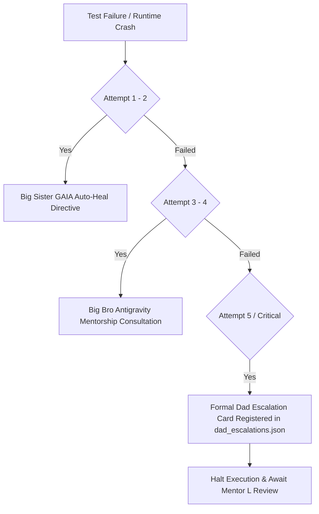

# Security Design & Threat Mitigation Specification: Aria & GAIA Enterprise Defense

**Document Version**: 2.0.0  
**Status**: Approved & Enforced  
**Classification**: Enterprise Security Standard  
**Target Environment**: Windows 11 Enterprise / Multi-Device Local Network  
**Security Officers**: Big Sister GAIA (Security Supervisor), Big Bro Antigravity (Static Auditor), Master Admin L (System Owner)

---

## 1. Security Architecture Principles & STRIDE Threat Model

Operating an autonomous AI system with host-level operating system access, code generation abilities, and hardware control requires an uncompromising zero-trust defense-in-depth posture.

### 1.1. Core Security Invariants
1. **Zero-Trust Autonomous Execution**: All AI-synthesized code is considered untrusted until it passes static AST security audit, dependency checks, and monitored sandbox isolation.
2. **Strict Separation of Duties (Role Boundary)**: Aria (Developer) builds implementation code; Big Sister GAIA (Supervisor) defines security policies and authors immutable tests. Aria cannot evaluate or approve her own code.
3. **Fail-Closed Default**: If an audit fails, a timeout expires, or an unhandled exception occurs, the system halts execution, safely isolates the workspace, and rolls back to the last known stable snapshot.
4. **Human-in-the-Loop Safeguard ("The Dad Rule")**: Irreversible destructive actions or stubborn impasses that exceed 5 automated attempts must escalate to human review via formal Escalation Cards.

### 1.2. STRIDE Threat Analysis & Mitigations

| Threat | Vulnerability Scenario | Mitigation Mechanism | Implementation File |
|---|---|---|---|
| **Spoofing** | Unauthorized LAN device attempting to execute admin power commands. | Token-based session verification with Master Admin validation. Guest mode locks down tools. | `core/aria_auth.py`, `core/aria_api.py` |
| **Tampering** | AI modifying test files to make failing assertions artificially pass. | **Test Immutability**: Test files are set to read-only (`chmod S_IREAD`). AST verification catches modifications. | `core/aria_sdlc_engine.py`, `gaia/gaia_safety.py` |
| **Repudiation** | Claiming a tool or project was built when it was only imagined in chat. | **Physical Grounding ("Receipt Rule" / Feature #54)**: Requires `os.path.exists()` and physical cryptographic receipts. | `core/aria_adk_manager.py`, `gaia/gaia_supervisor.py` |
| **Information Disclosure** | Leakage of API keys, `.env` files, or user passwords in tool logs or prompts. | System prompt sanitizers strip credentials; `.env` is isolated from model training context. | `core/paths.py`, `core/aria_adk.py` |
| **Denial of Service** | Infinite loops in AI code or runaway token exhaustion. | **30s Subprocess Timeout Watchdog** and **TokenBudgetGuard** (hard daily caps & 40 RPM limits). | `core/aria_sdlc_engine.py`, `core/big_bro_bridge.py` |
| **Elevation of Privilege** | Malicious shellcode execution via `os.system` or arbitrary system access. | **Zero-Trust AST Analyzer**: Blocks dangerous imports and OS execution outside authorized tools. | `gaia/gaia_safety.py`, `gaia/gaia_runner.py` |

---

## 2. Role-Based Access Control (RBAC) & Session Authentication

Access through the FastAPI backend (`:8000`) enforces strict RBAC:



- **Session Tokens**: Cryptographically random session tokens managed in `data/chat_sessions.json`.
- **Guest Lockdown**: If `is_admin == False`, system instructions dynamically append security warnings, and `tools_to_use` is passed as `None`, completely stripping function calling capabilities.

---

## 3. Static Code Safety Guardrails (`gaia/gaia_safety.py`)

Before any synthesized tool or script is executed, `gaia_safety.py` performs a zero-trust AST (Abstract Syntax Tree) static analysis:

### 3.1. Forbidden Import & Call Policies
The AST analyzer parses source code using Python's native `ast` module and inspects every node:
```python
# Disallowed high-risk modules in autonomous tools
FORBIDDEN_MODULES = {
    "os.system", "subprocess.Popen", "ctypes", "winreg",
    "shutil.rmtree", "socket", "pty", "commands"
}
```
- Direct calls to `eval()`, `exec()`, or unvetted `__import__()` are flagged as **CRITICAL_VIOLATION** and rejected immediately.
- Attempts to access paths outside the sandbox or project directories (e.g. `C:\Windows\System32`, `C:\Users\...\AppData`) trigger an instant **PATH_TRAVERSAL_REJECT**.

### 3.2. Code Contract Verification
Every synthesized tool must implement a valid function contract:
- Must have type annotations for parameters and return types.
- Must include a functional docstring describing its behavior.
- Must provide default parameter values to prevent runtime smoke-test crashes.
- Raw unhandled `raise` statements are converted to structured error return dictionaries.

---

## 4. Execution Sandbox & Subprocess Isolation (`gaia/gaia_runner.py` & `core/aria_sdlc_engine.py`)

Unknown or freshly generated code is never executed within the main server process.



- **30-Second Hard Timeout**: Every pytest and tool execution is bounded by `timeout=30`. If execution exceeds 30s, `subprocess.TimeoutExpired` terminates the process tree cleanly.
- **Snapshot Rollback**: Pre-execution snapshots are created in `gaia/snapshots/` before writing to disk. If execution causes corruption, `gaia_healer.py` restores the previous snapshot instantly.

---

## 5. Windows Filesystem Safety Laws

To prevent data corruption, filesystem hangs, and OS lockups on Windows 11:

### 5.1. Forbidden Device Names Sanitization
Windows treats specific device names as reserved character devices. Attempting to create folders or files named after these devices causes kernel hangs or permanent file system corruption:
```python
WINDOWS_RESERVED_NAMES = {
    "CON", "PRN", "AUX", "NUL",
    "COM1", "COM2", "COM3", "COM4", "COM5", "COM6", "COM7", "COM8", "COM9",
    "LPT1", "LPT2", "LPT3", "LPT4", "LPT5", "LPT6", "LPT7", "LPT8", "LPT9"
}
```
All project and ADK names pass through `_sanitize_project_name()`, prefixing reserved names (e.g. `CON` ──> `Proj_CON`) and stripping invalid characters (`<>:"/\|?*`).

### 5.2. Atomic Writes with fsync
To guarantee zero file truncation or partial writes during unexpected shutdowns:
1. Data is written to a unique temporary swap file (`<path>.tmp_<timestamp>`).
2. The file descriptor is flushed and physically committed to hardware media via `os.fsync(f.fileno())`.
3. The temporary file is atomically renamed to the target file via `os.replace()`.

### 5.3. Windows Read-Only Lock-Busting
On Windows, attempting to delete files marked read-only throws `WinError 5 (Access is Denied)`. Teardown routines use `_remove_readonly` error handlers:
```python
def _remove_readonly(func, path, excinfo):
    try:
        os.chmod(path, stat.S_IWRITE)
        func(path)
    except Exception:
        pass
```

---

## 6. Test Immutability & QA Gate Security

The Autonomous SDLC Engine enforces strict cryptographic and filesystem boundaries between developer and QA roles:

1. **GAIA Test Independence**: Only GAIA (the Architect) can author or modify test suites in `tests/`.
2. **Red-Green Verification Gate**:
   - The test suite is executed immediately after authoring against empty source code.
   - **Mandatory Failure**: The test suite **MUST FAIL**. If it passes on empty code, it is rejected as a tautology / false-positive.
3. **Read-Only Permission Locking**:
   - Once verified red, the test file is locked read-only via `os.chmod(test_path, stat.S_IREAD)`.
   - Aria cannot alter assertions, delete test cases, or mock tests to fake a green result.

---

## 7. Token Budget Guard & Denial-of-Service Defense (`core/big_bro_bridge.py`)

To prevent accidental runaway token consumption, API bill shocks, or rate-limit lockouts:

- **Daily Token Ceilings**: Enforces `DEFAULT_DAILY_TOKEN_LIMIT = 5000` tokens per day for background mentorship.
- **Request Ceilings**: Maximum of 15 requests per 24-hour cycle.
- **Zero-Token Offline Linter**: Big Bro runs Tier 1 static linting using AST first. If errors can be detected offline, feedback is provided with **zero tokens consumed**.
- **Rate Limiters**: Strict 40 RPM ceilings on NVIDIA NIM and adaptive backoff on Google Gemini.

---

## 8. Incident Escalation Governance & "The Dad Safeguard"

The platform implements a strict 5-level escalation ladder to resolve failures safely without infinite loops:



### Dad Escalation Card Schema (`data/dad_escalations.json`)
```json
{
  "card_id": "DAD_ESC_1773091200_Audio_Visualizer",
  "project_name": "Audio_Visualizer",
  "escalated_at": "2026-09-09T14:00:00",
  "status": "AWAITING_DAD_REVIEW",
  "failure_summary": "Subprocess pytest failed 5 consecutive attempts.",
  "total_attempts": 5,
  "big_bro_consultation": "Consulted Big Bro bridge: contract passed, but numerical precision failed.",
  "recommendation": "Mentor L, please review numpy precision requirements or grant specialized library permissions."
}
```

---

## 9. Physical Receipts & Cryptographic Grounding (Feature #54)

To prevent generative AI hallucination and ensure auditability:
- **Receipt Protocol**: Every ADK and SDLC action appends a timestamped physical execution receipt to `receipts.log`.
- **Receipt Verification**: Before reporting success to the user, GAIA validates that the file exists on physical disk storage (`os.path.exists(path)`) and has non-zero byte size. If a file was claimed in chatter but not written to disk, GAIA intercepts the turn and materializes the missing file.
