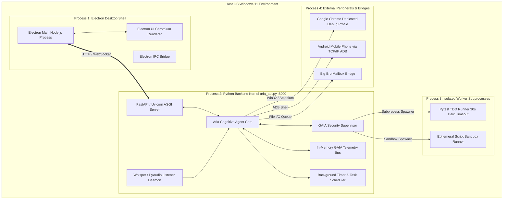
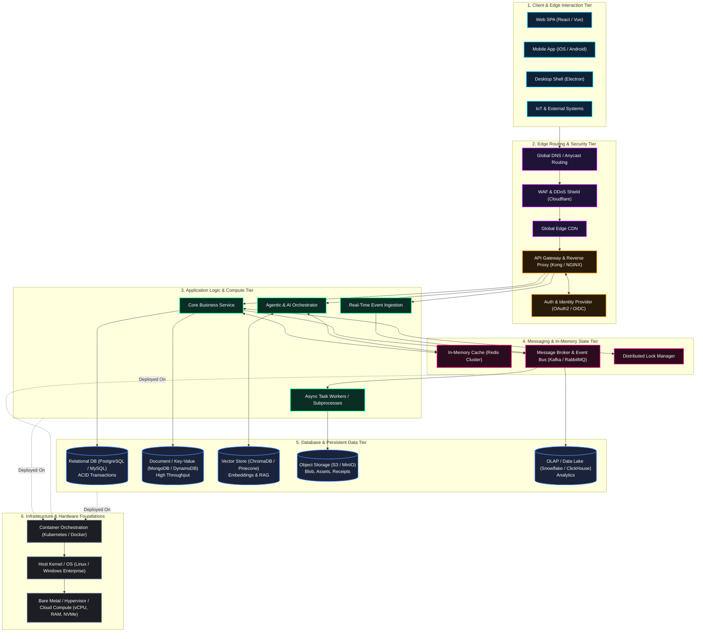
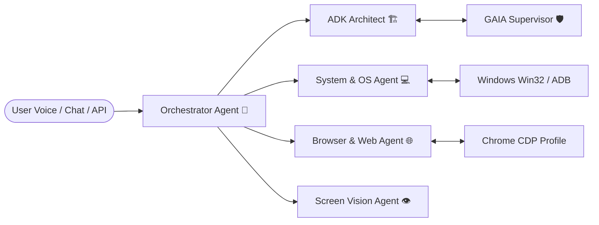
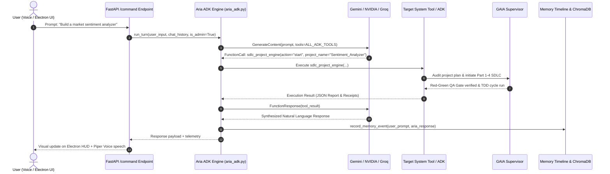
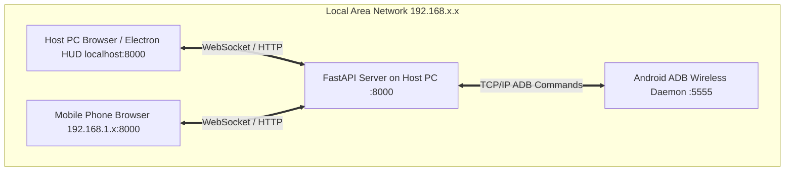

# System Architecture Blueprint: Aria & GAIA Multi-Agent Workstation Topology

**Document Version**: 2.0.0  
**Status**: Approved & Implemented  
**Target Environment**: Windows 11 Enterprise (x64) / Multi-Device Local Area Network  
**Primary Workspaces**: `C:\MyAgent` (Core Host Platform) & `E:\ARIA FILES` (Autonomous SDLC Workstation)  
**Authors**: Big Sister GAIA (Architect), Aria (Developer), Big Bro Antigravity (Senior Mentor)

---

## 1. Architectural Topology & Runtime Process Hierarchy

The Aria & GAIA system is deployed as a hybrid process architecture combining an asynchronous backend kernel, an event-driven telemetry bus, a hardware sensory loop, and isolated sandboxed worker subprocesses:



---

## 2. Enterprise 6-Tier Cloud, Edge & Agentic System Blueprint

The following blueprint defines the target enterprise architecture topology spanning client interaction, security gateways, compute orchestration, streaming states, persistence, and host infrastructure:



### 2.1. Tier-by-Tier Component Mapping in `c:\MyAgent`

| Tier | Component | Technology & Responsibility | Current Local Implementation in `MyAgent` | Cloud Enterprise Target |
|---|---|---|---|---|
| **L1: Client** | `Desktop` | Cyberpunk Holographic HUD | `electron/` (Chromium + Node.js shell) | Electron Windows / macOS App |
| | `Mobile` | Mobile Remote Companion | `tools/aria_android.py` (ADB over Wi-Fi) | Flutter / React Native App |
| | `Web` | Browser Web Interface | Web portal bound to `aria_api.py:8000` | Next.js / React SPA on Vercel |
| | `IoT` | Smart Home & Hardware | `aria_extended.py` (Home Assistant Webhooks) | MQTT / Zigbee Gateway |
| **L2: Edge** | `APIGW` | API Gateway & Routing | `core/aria_api.py` (FastAPI routing & CORS) | Kong Gateway / NGINX Ingress |
| | `Auth` | Authentication & RBAC | `core/aria_auth.py` (Admin `L` vs Guest token) | Keycloak / Auth0 OAuth2 OIDC |
| | `WAF / CDN` | Edge Protection & Speed | FastAPI rate limiters & static caching | Cloudflare Enterprise WAF |
| **L3: Compute** | `AgentOrch` | Agentic & AI Orchestrator | `core/aria_adk.py` & `aria_adk_manager.py` | Ray / Celery Agent Cluster |
| | `CoreAPI` | Business & Assistant Logic | `core/aria_api.py` (:8000) & `agent_core.py` | FastAPI Microservices in K8s |
| | `WorkerFleet`| Subprocesses & TDD | `core/aria_sdlc_engine.py` (30s isolated workers) | Kubernetes Jobs / Temporal Workers |
| | `Ingestion` | Live Telemetry Ingestion | `gaia/gaia_bus.py` in-memory event streaming | Vector / Logstash Ingestion |
| **L4: State** | `StateLock` | Concurrency Lock | `data/active_project_lock.json` | Redis Distributed Redlock |
| | `Queue` | Event Bus & Messaging | `gaia/gaia_bus.py` & `core/big_bro_bridge.py` | Apache Kafka / RabbitMQ |
| | `Cache` | In-Memory Hot Cache | `core/aria_skills_manager.py` mtime cache | Redis Cluster (ElastiCache) |
| **L5: Storage** | `VectorDB` | Embeddings & RAG | `data/chroma/` (ChromaDB + all-MiniLM-L6-v2) | Managed Pinecone / Chroma Cluster |
| | `NoSQL` | Document State & Ledgers | `data/chat_sessions.json`, `project_ledger.json` | MongoDB / DynamoDB |
| | `RDBMS` | ACID Structured Data | SQLite / Structured Python Schemas | Amazon RDS PostgreSQL |
| | `ObjStore` | Artifacts & Receipts | `E:\ARIA FILES\` & Feature #54 Receipts | AWS S3 / MinIO Object Storage |
| | `DataWarehouse`| Insights & Analytics | `data/project_insights.json` | ClickHouse / Snowflake |
| **L6: Infra** | `Orchestration`| Execution Isolation | Python subprocess sandbox & AST isolation | Kubernetes (EKS/GKE) + Docker |
| | `OS` | Host Operating System | Windows 11 Enterprise (x64) | Ubuntu Linux LTS / Windows Server |
| | `Hardware` | Compute & Accelerators | Intel Core / AMD CPU + NVIDIA RTX GPU + NVMe | Bare Metal GPU Nodes (A100/H100) |

---

## 3. Physical Disk & Directory Topology

The file system architecture enforces strict physical separation of concerns across drives and directories:

### 2.1. Core Host Repository (`C:\MyAgent`)
Houses the application code, system runtime, configuration, and long-term memory:
```text
C:\MyAgent/
├── core/                       # Core engine modules
│   ├── aria_adk.py             # ADK tool reflection & multi-hop model executor
│   ├── aria_adk_manager.py     # Autonomous ADK lifecycle management engine
│   ├── aria_sdlc_engine.py     # 4-Part Autonomous SDLC engine
│   ├── aria_api.py             # FastAPI REST & WebSocket server (port 8000)
│   ├── agent.py & agent_core.py# Conversational loops, audio transcription, TTS
│   ├── aria_memory.py          # Vector embeddings & episodic memory store
│   ├── aria_brains.py          # Multi-LLM provider routing (Gemini, NVIDIA, Groq, Ollama)
│   ├── aria_skills_manager.py  # Procedural skills dynamic loader (mtime cache)
│   ├── big_bro_bridge.py       # Big Bro Antigravity mentorship bridge & static linter
│   ├── aria_state_guard.py     # Zero-work-loss crash recovery guard
│   └── paths.py                # Canonical path resolver
├── gaia/                       # Big Sister GAIA supervisor & evolution engine
│   ├── gaia_supervisor.py      # Code auditing, snapshots, auto-healing, reality checks
│   ├── gaia_architect.py       # Architect Sandbox & two-track code evolution
│   ├── gaia_safety.py          # Zero-trust AST static safety analyzer
│   ├── gaia_runner.py          # Sandboxed subprocess runner
│   ├── gaia_healer.py          # Snapshot management and rollback engine
│   └── gaia_bus.py             # High-speed in-memory event bus
├── system_tools/               # Callable function-calling tool wrappers
│   ├── adk_management.py       # Tool interface for ADK lifecycle verbs
│   └── sdlc_project_engine.py  # Tool interface for autonomous SDLC pipeline
├── tools/                      # Native operating system & hardware tools
│   ├── aria_android.py         # Wireless ADB controller for mobile phones
│   ├── aria_tools.py           # Web research, news, wikipedia, user goals
│   └── aria_scheduler.py       # Timers, alarms, and scheduled reminders
├── docs/                       # Architectural documentation & modular guidelines
│   ├── guidelines/             # Procedural skills auto-loaded by skills manager
│   │   ├── adk_management.md
│   │   ├── sdlc_project_engine.md
│   │   ├── file_structuring.md
│   │   ├── web_development.md
│   │   └── polyglot_coding.md
│   ├── system_design.md        # Complete system design document
│   ├── system_architecture.md  # Architectural blueprint document
│   └── security_design.md      # Security & threat mitigation specification
├── data/                       # Persistent databases, memory, and runtime locks
│   ├── active_project_lock.json# Atomic single-project concurrency lock
│   ├── dad_escalations.json    # Formal escalation cards for Mentor L
│   ├── project_insights.json   # Distilled breakthroughs from finished projects
│   ├── personality/            # Formative narratives (aria_personality.json, etc.)
│   ├── chat_sessions.json      # Multi-turn chat session logs
│   └── chroma/                 # Local ChromaDB persistent vector database
├── adks/                       # Active & installed Agent Development Kits
│   └── <adk_name>/             # Manifest, tools.py, rules.md, test_adk.py, receipts.log
├── electron/                   # Electron GUI frontend application
└── tests/                      # Automated test verification suites
```

### 2.2. Autonomous SDLC Workstation (`E:\ARIA FILES`)
Dedicated secondary drive workspace for enterprise engineering deliverables:
```text
E:\ARIA FILES/
├── Projects/                   # Enterprise software engineering projects
│   └── <Project_Name>/         # Single active project directory
│       ├── docs/               # ARCHITECTURE.md, TASK_LIST.md, CHECKLIST.md
│       ├── src/                # Permanent production deliverables (main_module.py)
│       ├── tests/              # GAIA managed independent tests (read-only chmod)
│       ├── adks/               # Ephemeral specialized ADK swarm (purged on clean slate)
│       └── database/           # project_ledger.json (state, receipts, milestones)
├── ADKs/                       # External / exported ADK repository
├── Code/                       # Modular scripts and code snippets
└── Documents/                  # Exported technical reports and briefs
```

### 2.3. GAIA Dedicated Architect Sandbox (`E:\gaia_architect` or `E:\MyAgent\gaia_architect`)
Dedicated isolation sandbox for autonomous architecture evolution:
```text
E:\gaia_architect/
├── workspace/                  # Scratch execution area for code diagnosis
├── backups/                    # Automated pre-deployment snapshots
├── incidents/                  # Incident logs and failure reports
├── patches/                    # Track 2 unified .diff patch proposals awaiting human review
├── tests/                      # Architectural contract verification tests
└── architect_ledger.json       # Audit ledger of all deployments, patches, and health metrics
```

---

## 3. Sub-Agent Swarm Metadata & Role Topology

The system operates as an intelligent multi-agent swarm coordinated by the top-level **Orchestrator**:



### Swarm Agent Specification
| Agent ID | Name | Role | Core Equipped Tools |
|---|---|---|---|
| `orchestrator` | Aria Core Orchestrator | Intent routing, conversational reasoning, and swarm coordination. | `switch_ai_brain`, `adk_management`, `sdlc_project_engine`, `build_sandbox_tool`, `aria_open_in_vscode` |
| `adk_architect` | ADK Lifecycle Architect | Autonomous ADK creation, DAG pipeline chaining, AST security audits, clean slate teardown. | `adk_management`, `sdlc_project_engine` |
| `system` | System & OS Agent | Windows automation, application launch, hardware health, file structuring, power management. | `open_application`, `search_and_open_document`, `aria_manage_file`, `execute_powershell_command`, `adk_management`, `sdlc_project_engine` |
| `browser` | Browser & Web Agent | Chrome browser automation, live web searching, Wikipedia extraction, financial data RAG. | `chrome_research`, `chrome_open_url`, `chrome_read_current_page`, `get_latest_news`, `get_crypto_price` |
| `vision` | Screen Vision Agent | Multimodal monitor screenshot analysis, OCR reading, UI element coordinate detection and clicking. | `see_and_analyze_screen`, `visual_click_element` |

---

## 4. End-to-End Data Flow & Sequence Architecture



---

## 5. Subprocess Isolation & Concurrency Control Architecture

### 5.1. Single-Project Concurrency Lock (`data/active_project_lock.json`)
Guarantees strictly **one big project at a time**:
- When `acquire_lock(project_name, topic)` is called:
  - If a project is already active with status `IN_PROGRESS` and a different name, the request is immediately rejected with an error.
  - If no project is active, writes atomic lock metadata (project name, PID, timestamp, current phase).
- When the project passes all QA tests, `release_lock("COMPLETED")` clears `is_locked = False`.

### 5.2. Isolated 30s Worker Subprocess Runner
Execution of unknown or freshly synthesized code is never executed inside the main API process.
- **Isolated Spawning**: Invoked via `subprocess.run([sys.executable, "-m", "pytest", tests_dir, "-v", "-o", "pythonpath=src"], cwd=project_dir, timeout=30)`.
- **Strict 30s Watchdog**: If a test hangs in an infinite loop, `subprocess.TimeoutExpired` terminates the child process immediately, returning an error traceback to the auto-heal loop.
- **Role Boundary & Test Immutability**:
  - GAIA authors the test suite in `tests/test_<project>.py`.
  - The test file is locked read-only via `os.chmod(path, stat.S_IREAD)`.
  - Aria's implementation code in `src/` can read tests but cannot modify test assertions.

---

## 6. Storage, Memory & Database Architecture

### 6.1. ChromaDB Vector Embeddings Architecture
- **Engine**: ChromaDB running locally in client-embedded persistent mode at `data/chroma/`.
- **Embedding Model**: `sentence-transformers/all-MiniLM-L6-v2` (384-dimensional vector space).
- **Collection**: `aria_knowledge`.
- **Data Ingested**: Completed project insights, tool documentation, architectural patterns, and user preferences.

### 6.2. Atomic File I/O & Swap-File Protocol
To prevent corruption during host crashes or power loss:
```python
def _atomic_write(file_path: str, content: str) -> bool:
    tmp_path = f"{file_path}.tmp_{int(time.time() * 1000)}"
    with open(tmp_path, "w", encoding="utf-8") as f:
        f.write(content)
        f.flush()
        os.fsync(f.fileno())  # Force commit to physical disk media
    os.replace(tmp_path, file_path)  # Atomic rename
    return True
```

---

## 7. Multi-Device Network Architecture



- **Network Binding**: Binds to `0.0.0.0:8000` with local IP auto-discovery (`get_local_ip()`).
- **Session Authentication**: Token-based authentication (`aria_auth.py`). Validated sessions distinguish between Master Admin (`L`) and Guest users.
- **CORS & Multi-Device Security**: Strict CORS headers permitting local host and approved LAN devices.
