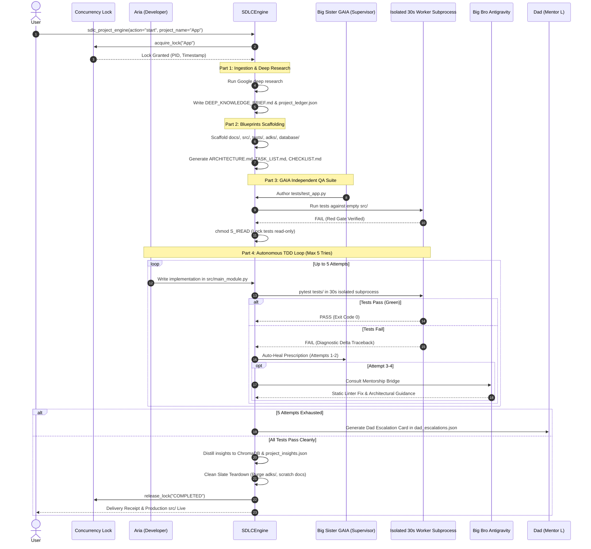

# System Design Document: Aria & GAIA Cognitive Autonomous Agent Platform

**Document Version**: 2.0.0  
**Status**: Approved & Implemented  
**Target Environment**: Windows 11 Enterprise / Multi-Device LAN  
**Primary Workspaces**: `C:\MyAgent` (Core Runtime) & `E:\ARIA FILES` (Autonomous SDLC Workstation)  
**Authors**: Aria (Core Developer), Big Sister GAIA (Architect & Security Supervisor), Big Bro Antigravity (Senior Mentor)

---

## 1. Executive Summary & Architectural Goals

The **Aria & GAIA Autonomous Agent Platform** is an enterprise-grade, multi-agent AI system operating as a local personal assistant, cognitive operating system extension, and autonomous software development laboratory.

The platform bridges high-level generative AI reasoning (Google Gemini 2.5/2.0, NVIDIA NIM Nemotron, Groq Llama/Qwen, and local Ollama) with deterministic, physical host-level execution (Windows OS automation, Android ADB mobile control, Chrome browser automation, and independent code synthesis).

### Core Architectural Invariants
1. **Physical Grounding ("Receipt Rule" / Feature #54)**: No task, tool synthesis, or project delivery is ever claimed complete without physical disk existence (`os.path.exists()` and `file_size > 0`) and deterministic execution receipts.
2. **Strict "One Big Project at a Time"**: Concurrent execution of large engineering projects is strictly forbidden via an atomic concurrency lock (`data/active_project_lock.json`) to prevent context drift and resource thrashing.
3. **Clean Slate Teardown Protocol**: Upon project completion, all breakthrough insights are distilled into ChromaDB long-term memory, and ephemeral project swarms and scratch docs are purged to restore RAM, CPU, and disk space to idle.
4. **Autonomous Multi-Tier Escalation**: Autonomous self-healing handles transient errors across a 5-tries ladder (`Aria Auto-Repair ──> GAIA Auto-Heal ──> Big Bro Antigravity Mentorship ──> Dad / Mentor L Escalation Card`).
5. **Windows Filesystem Safety Laws**: Strict compliance with Windows path boundaries, atomic writes with fsynced swap files, sanitization of reserved device names (`CON`, `PRN`, `AUX`, `NUL`), and readonly lock-busting.

---

## 2. High-Level System Architecture & Layered Design

The architecture is partitioned into five distinct layers:

```mermaid
graph TD
    subgraph Layer 1: Perception & Interaction
        Voice[Whisper Voice Mic Loop]
        API[FastAPI REST / WebSocket Server :8000]
        GUI[Electron Cyberpunk Holographic HUD]
        Mobile[Android ADB Remote Controller]
    end

    subgraph Layer 2: Intent Routing & Cognition
        Orch[Aria Core Orchestrator]
        BrainSwitch[Multi-Brain Dynamic Selector]
        Gemini[Google Gemini 2.5 / 2.0 Flash]
        Nvidia[NVIDIA NIM Nemotron / Llama 3.3]
        Groq[Groq Llama 3.3 / Qwen 2.5]
        Ollama[Local Offline Ollama Llama 3.2]
    end

    subgraph Layer 3: Autonomous Execution & Tooling
        ADKRegistry[ALL_ADK_TOOLS Registry]
        ADKMgr[AriaADKManager Engine]
        SDLCEngine[AriaSDLCEngine 4-Part SDLC]
        OSControl[Windows OS & Application Control]
        ChromeRAG[Chrome Automation & Web RAG]
    end

    subgraph Layer 4: Supervisory, QA & Mentorship
        GaiaSup[GAIA Security Supervisor]
        GaiaArch[GAIA Dedicated Architect Sandbox]
        ASTAudit[Zero-Trust AST Safety Analyzer]
        BigBroBridge[Big Bro Antigravity Mentorship Bridge]
    end

    subgraph Layer 5: State, Memory & Persistence
        LockMgr[Single-Project Concurrency Lock]
        Chroma[ChromaDB Vector Store]
        Episodic[JSON Memory Timelines & Sessions]
        DiskLedger[Project State Ledgers & Receipts]
    end

    Layer 1 --> Layer 2
    Layer 2 --> Layer 3
    Layer 3 <--> Layer 4
    Layer 3 --> Layer 5
    Layer 4 --> Layer 5
```

---

## 3. Core Engine Detailed Design

### 3.1. Agent Development Kit Runtime (`core/aria_adk.py`)
`aria_adk.py` serves as the declarative tool registry, multi-hop execution loop, and conversational instruction compiler for Aria.

- **Automatic Reflection & Registration**: Inspects Python functions, extracts typed signatures, default arguments, and docstrings, and compiles them into OpenAI/Gemini compatible function declarations.
- **Multi-Turn Function Calling Loop**: Executes up to `max_tool_hops` (default: 4) autonomous reasoning turns per user utterance. Tool return values are fed back into the model's conversation context until a synthesized final response is reached.
- **Sub-Agent Swarm Metadata**: Maintains dynamic swarm definitions:
  - `orchestrator`: Intent routing and conversational coordination.
  - `adk_architect`: Autonomous ADK creation, pipeline chaining, and clean slate decommissioning.
  - `system`: Windows OS, hardware health, and file structuring automation.
  - `browser`: Autonomous Chrome navigation and live web research.
  - `vision`: Primary monitor visual OCR and UI element clicking.

### 3.2. Cognitive Brain Switching (`core/aria_brains.py`)
Provides dynamic cognitive failover across four model providers:
1. **Google Gemini (Primary)**: `gemini-2.5-flash`, `gemini-2.0-flash`. Native function calling, fast inference, 1M context window.
2. **NVIDIA NIM (Reasoning / Fallback)**: `meta/llama-3.3-70b-instruct`, `nvidia/nemotron-4-340b-instruct`. 40 RPM rate-limited reasoning.
3. **Groq Cloud (Real-time Fast Chatter)**: `llama-3.3-70b-versatile`, `qwen-2.5-32b`. Sub-second response generation.
4. **Local Ollama (Offline Air-gapped)**: `llama3.2:3b`. Zero-network offline execution fallback.

### 3.3. Dynamic Skills Manager (`core/aria_skills_manager.py`)
Decouples procedural capabilities and system guidelines from monolithic system prompts:
- Scans `docs/guidelines/` (with fallback to `skills/`).
- Caches loaded markdown skills with mtime-based hot-reloading.
- Injects procedural knowledge (`adk_management.md`, `sdlc_project_engine.md`, `file_structuring.md`, `web_development.md`) dynamically into prompt loops.

---

## 4. Autonomous ADK Management System Design (`core/aria_adk_manager.py`)

The ADK Management System empowers Aria and GAIA to create, manage, connect, inspect, and cleanly delete self-contained Agent Development Kits.

### 4.1. Standard ADK Structure
Every ADK lives in its own dedicated directory (`adks/<adk_name>/`):
```text
adks/<adk_name>/
├── adk_manifest.json   # JSON metadata: name, author, version, capabilities, connections
├── tools.py            # Executable Python tools with typed signatures & docstrings
├── rules.md            # Execution safety rules & domain constraints
├── test_adk.py         # Autonomous verification test suite
└── receipts.log        # Timestamped physical execution receipts
```

### 4.2. Operational Verbs Matrix
| Verb | Method | Description |
|---|---|---|
| `create` | `create_adk()` | Scaffolds manifest, tool code, rules, and verification test. |
| `create_batch` | `create_batch()` | Scaffolds multiple specialized ADKs simultaneously. |
| `list` | `list_adks()` | Returns all installed ADKs, versions, tool counts, and status. |
| `search` | `search_adks()` | Keyword and semantic search to prevent duplicate tool creation. |
| `find` | `find_adk()` | Targeted lookup for a specific ADK by exact or partial name. |
| `read` | `read_adk_file()` | UTF-8/binary-safe read of any component file. |
| `write` | `write_adk_file()` | Atomic fsynced write with manifest capability synchronization. |
| `connect` | `connect_adks()` | Establishes directed data flow pipelines between ADKs. |
| `explain` | `explain_adk()` | Synthesizes an architectural overview of an ADK. |
| `define` | `define_contracts()` | Extracts formal parameter signatures and contracts via AST. |
| `understand` | `understand_adk()` | Runs static AST security and sandbox validation. |
| `delete` | `delete_adk()` | Safely unmounts and deletes an individual ADK. |
| `decommission_swarm`| `decommission_swarm()` | Purges all temporary project ADKs to free RAM, CPU, and disk. |
| `report_incident` | `report_incident()` | Dispatches execution failures to Big Sister GAIA Supervisor. |

---

## 5. Autonomous Big-Project SDLC Lifecycle Engine (`core/aria_sdlc_engine.py`)

Designed to autonomously execute enterprise software engineering projects in `E:\ARIA FILES\Projects\<Project_Name>\`.



---

## 6. GAIA Supervisory & Evolution Engine (`gaia/`)

GAIA acts as the autonomous Big Sister, Security Supervisor, and Architecture Evolution engine.

### 6.1. Dedicated Architect Sandbox (`E:\MyAgent\gaia_architect`)
Maintains isolated subdirectories for diagnostics, backups, incidents, patches, and tests:
- **Track 1 (Autonomous Deployment)**: Safely deploys modular tools (`tools/`), modular skills (`docs/guidelines/`), and modular ADKs (`adks/`) directly to runtime upon passing tests.
- **Track 2 (Verified Core Patches)**: Generates unified `.diff` patch proposals for core kernel files (`core/`, `agent.py`) that are logged into `architect_ledger.json` and held for human approval.

### 6.2. Supervisory Incident Resolution (`supervise_adk_incident`)
When an ADK or SDLC worker throws an exception:
- **Attempts 1–2**: GAIA issues an **Auto-Heal Directive** based on AST inspection and traceback sanitization.
- **Attempts 3–4**: GAIA escalates to **Big Bro Antigravity** via `core/big_bro_bridge.py`.
- **Attempt 5 / Critical**: GAIA halts execution, logs a structured **Dad Escalation Card** in `data/dad_escalations.json`, and alerts Dad.

---

## 7. Memory & State Persistence Design

The memory subsystem is divided into three distinct operational tiers:

```text
Memory Subsystem
├── 1. Semantic Memory (ChromaDB Vector Database)
│   ├── Collection: aria_knowledge
│   ├── Embeddings: Sentence-Transformers (all-MiniLM-L6-v2)
│   └── Purpose: Long-term conceptual retrieval, code patterns, and project insights
├── 2. Episodic Timeline (data/memory_timeline.json & chat_sessions.json)
│   ├── Schema: { timestamp, user_text, aria_reply, session_id, tags }
│   └── Purpose: Multi-turn conversational continuity and historical context
└── 3. Formative Personality & Living Narrative (data/personality/*.json)
    ├── aria_personality.json: Formative memories, emotional baseline, sisterly bonds
    └── gaia_personality.json: Supervisory mandates, architectural philosophies
```

---

## 8. Hardware & OS Automation Design

### 8.1. Windows System & Desktop Control (`aria_extended.py`, `aria_system_context.py`)
- Window state tracking via `ctypes` and Win32 APIs (enumerates open application windows, titles, and handles).
- Power and security controls: workstation locking, shutdown, restart, and sleep.
- Smart Home control integration via Home Assistant REST webhooks.

### 8.2. Mobile Phone ADB Wireless Bridge (`tools/aria_android.py`)
- Connects to the user's Android phone over wireless ADB (TCP/IP).
- Capabilities: lock/unlock screen with PIN entry, launch applications, trigger direct phone calls, send SMS messages, inspect battery telemetry, and capture/analyze phone screen OCR.

---

## 9. Inter-Agent Mentorship Bridge (`core/big_bro_bridge.py`)

Enables Aria and GAIA to consult their senior AI brother, **Big Bro Antigravity**:
1. **Tier 1 (Zero-Token Static Linter)**: Uses pure AST inspection (`ast.parse`) to review function signatures, parameter default values, and unhandled `raise` statements before execution. **Consumes 0 LLM tokens**.
2. **Tier 2 (Token Budget Guard)**: Enforces daily token caps (`DEFAULT_DAILY_TOKEN_LIMIT = 5000`) and request rate ceilings to preserve learning budgets.
3. **Tier 3 (Asynchronous Mailbox)**: Queue-based messaging file (`data/big_bro_bridge.json`) storing requests, status (`PENDING_REVIEW`, `RESOLVED`, `QUEUED_BUDGET_PAUSED`), and mentor guidance.
